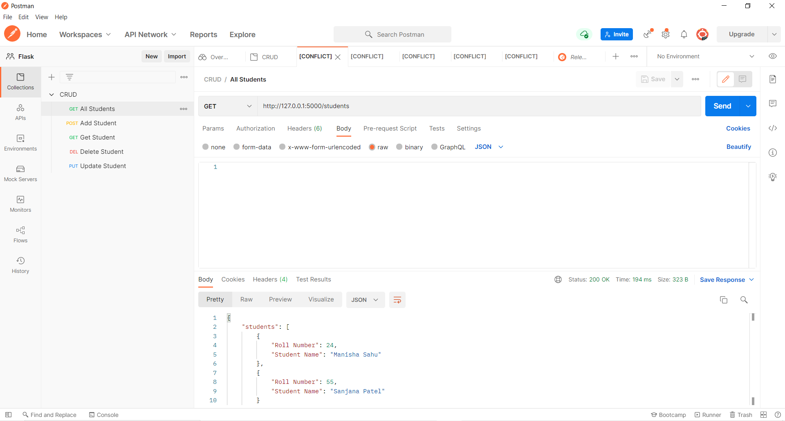
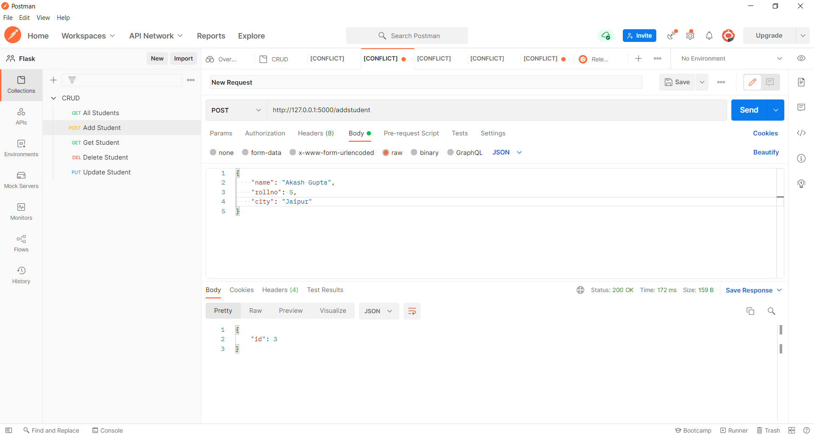
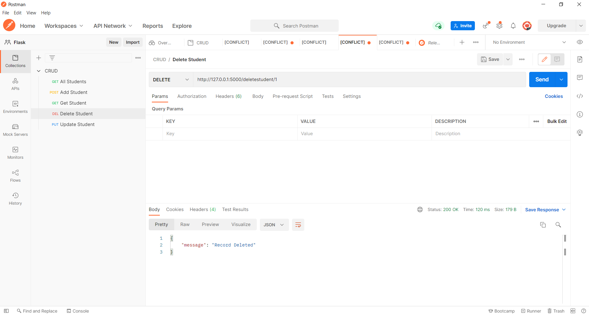

# Simple-CRUD-API-in-Flask


<!-- ABOUT THE PROJECT -->
## About The Project

### Get endpoint


### Put endpoint


### Post endpoint


### Delete endpoint



### Built With

* [Python](https://www.python.org/)
  
* [Flask](https://flask.palletsprojects.com/en/2.0.x/)


<!-- GETTING STARTED -->
## About Project
Create, Update, Read, Delete api's using Flask

### Prerequisites

1. Python == 3.8.8
2. Flask == 2.0.2
3. Werkzeug == 2.0.2

### Installation

1. Clone the repo
   ```sh
   git clone https://github.com/prettyquail/Simple-CRUD-API-in-Flask.git
   ```
2. activate the virtualenv.
3. run the project using "python run.py"
